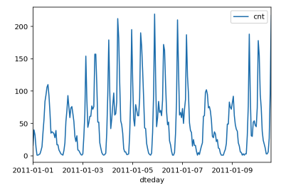
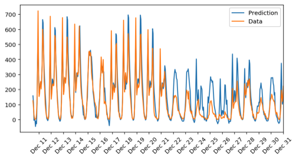

# Neural Network in Numpy

## Summary

In this project, we will build a neural network using NumPy, and use it to predict daily bike rental ridership. The my_answers.py file contains the class NeuralNetworks, which has several methods referenced in the Jupyter notebook.

## Data



This dataset has the number of riders for each hour of each day from January 1, 2011 to December 31, 2012. The number of riders is split between casual and registered, summed up in the cnt column. The plot above displays the number of bike riders over the first 10 days in the data set.

## Forward Pass

```python
def forward_pass_train(self, X):
        '''
            Arguments
            ---------
            X: features batch
        '''
        # Forward pass
        # Hidden layer
        hidden_inputs = np.dot(X, self.weights_input_to_hidden) # signals into hidden layer
        hidden_outputs = self.activation_function(hidden_inputs) # signals from hidden layer. apply sigmoid to hidden_inputs

        # Output layer
        final_inputs = np.dot(hidden_outputs, self.weights_hidden_to_output) # signals into final output layer
        final_outputs = final_inputs # signals from final output layer equal inputs since they wanted no activation function

        return final_outputs, hidden_outputs
```

Perform linear algebra using NumPy to calculate the outputs after the forward pass.

## Backpropagation

Calculate the error and then backpropagate the error through the network.

## Results



Seasonality around the Christmas holiday period is not captured by the model. This is probably because we are only training on two years of data, so we would only have two holiday periods to learn from.
